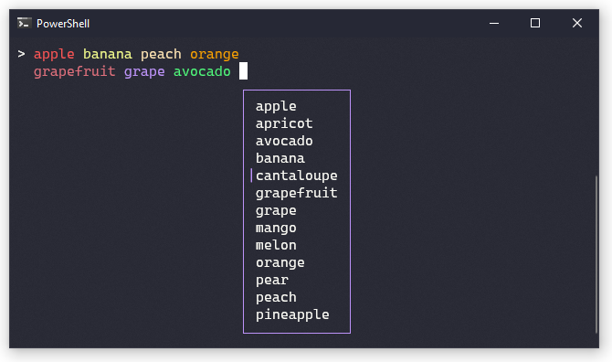

# PrettyPrompt


A cross-platform command line prompt that provides syntax highlighting, autocompletion, history and more! It's `Console.ReadLine()` on steroids.



## Features

- Syntax highlighting support via ANSI escape sequences.
- Autocompletion ("intellisense") menu
- History
- Optionally detects "incomplete" lines and converts "hard newlines" (<kbd>Enter</kbd>) to "soft enters" (<kbd>Shift-Enter</kbd>) 
- Soft newlines (Shift-Enter) for multi-lien input
- Word wrapping
- Familiar keybindings (Home, End, arrow keys, Ctrl-L to clear screen, Ctrl-C to cancel current line, etc)
- Works "in-line" on the command line; it doesn't take over the entire terminal window.

## Installation

PrettyPrompt can be [installed from nuget](https://www.nuget.org/packages/PrettyPrompt/) by running the following command:

```
dotnet add package PrettyPrompt
```

## Usage

A simple read-eval-print-loop looks like this:

```csharp

var prompt = new Prompt();

while (true)
{
    var response = await prompt.ReadLineAsync("> ");
    if (response.Success) // false if user cancels, i.e. ctrl-c
    {
        if (response.Text == "exit") break;

        Console.WriteLine("You wrote " + response.Text);
    }
}
```

The `Prompt` constructor takes optional configuration options for enabling syntax highlighting, autocompletion, and soft-newline configuration.
For a more complete example, see the project in the [`examples`](https://github.com/waf/PrettyPrompt/tree/main/examples/PrettyPrompt.Examples.FruitPrompt) directory.
If you have the [`dotnet example`](https://github.com/patriksvensson/dotnet-example) global tool installed, run the following command in the repository root:

```
dotnet example FruitPrompt
```

## Building from source

This application target .NET 5, and can be built with either Visual Studio or the normal `dotnet build` command line tool.
