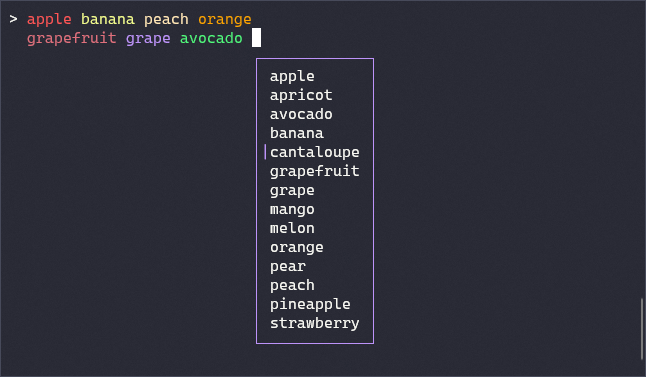

PrettyPrompt
============

A proof-of-concept prompt suitable for programming language REPLs. Written in C#.

Features:

- Syntax highlighting support via ANSI escape sequences.
- Autocompletion ("intellisense") menu
- Familiar keybindings (Home, End, arrow keys, Ctrl-L to clear screen, Ctrl-C to cancel current line)
- Soft newlines (shift-enter)
- Word wrapping
- Works "in-line" on the command line; it doesn't take over the entire terminal window.

Screenshot:

